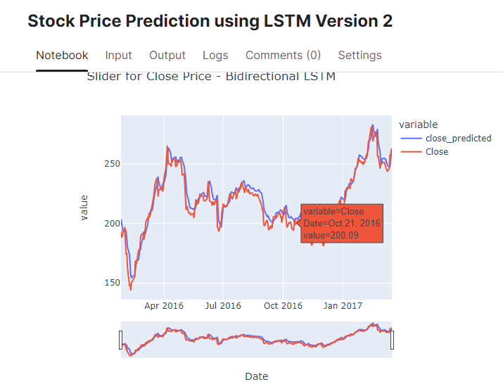
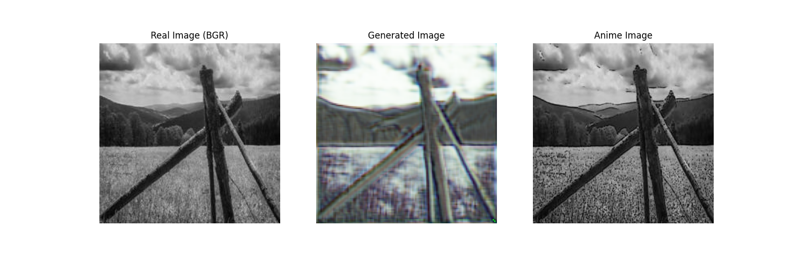
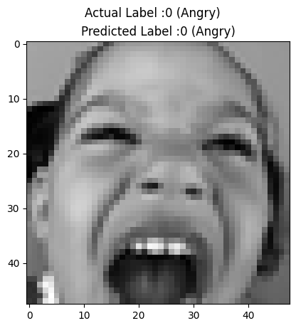
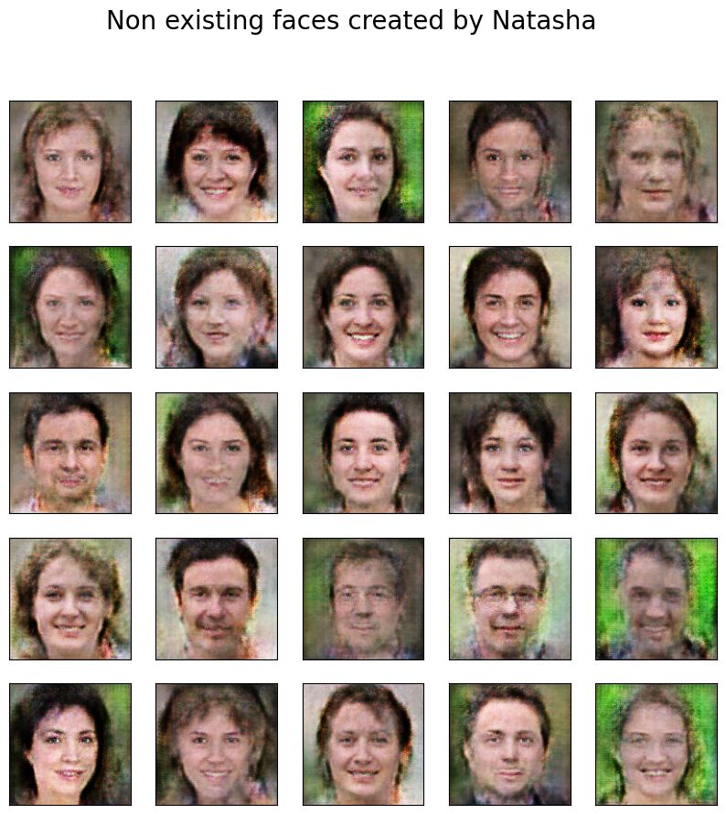

# NATASHA YUWARAJ MESHRAM 
- Email - sanchimeshram211@gmail.com
- Mobile - 9920460894

### Myself
Dedicated and passionate individual with a strong background in backend development and a burgeoning interest in machine learning and deep learning. With 2 years and 7 months of experience in software development, I have honed my skills in Python, SQL, (C,ProC, Unix). However, my fascination with the transformative potential of artificial intelligence has led me to embark on a journey to explore the realms of machine learning and deep learning.

I have been actively pursuing opportunities to expand my knowledge and expertise in the field of Deep Learning. Through self-study, online courses, and hands-on projects, I have been immersing myself in the intricacies of machine learning algorithms, neural networks, and data analysis techniques.

My experience in software development has equipped me with a strong foundation in problem-solving, critical thinking, and collaborative teamwork, which I believe are invaluable assets in the field of machine learning.
As I embark on this journey of transition, I am eager to leverage my existing skills and experiences to contribute meaningfully to the exciting developments unfolding in the world of artificial intelligence. I am committed to continuous learning, growth, and exploration, and I am excited about the possibilities that lie ahead in this dynamic and rapidly evolving field.
  
#### Looking for Fresher roles the Below Positions: -
## Data Scientist | Machine Learning Engineer | Deep Learning Engineer

#### Technical Skills : - Python for (ML, Deep Learning, Data Analysis),SQL,POWER BI, Advance Excel, Tensorflow
#### Projects :- Machine Learning, Deep Learning, Data Analysis and Creating Dashboard, NLP

## Education
- Bachelor of Computer Engineering (B.E) (2017-2021) | CGPA - 7.18 | University of Mumbai
- 12th (HSC Board)  PCM (Computer Science) (2016-2017) | Percentage -  76.15 | Maharashtra Board
- 10th (SSC Board)  (2014-2015) | Percentage - 85.40 | Maharashtra Board

## Work Experience
**Software Developer @ ICICI SECURITIES** (2021 - Present)
- Working on ProC, Python Programming language and Oracle (SQL Query Language) to deliver different products through Automation
- Have worked on different Whatsapp modules (for Automation and Analysis) and Site & App Login Modules

## Deep Learning Projects
### Stock Price Prediction using LSTM Version
- Data Analysis and Visualization along with Prediction of Close Price using [ Long Short Term Memory (LSTM) ] of Tesla Stock.
- [Project Link Here](https://www.kaggle.com/code/natashameshram/stock-price-prediction-using-lstm-version-2)
- 

### Generate Sketch Image using GAN
- Implemented cGAN to generate Sketch Image of the input we provide to the Generator
- [Project link here](https://www.kaggle.com/code/natashameshram/landscape-images-cgan)
- 

### Emotion Detection Using Convolution Neural Network
- Implemented Emotion Detection using Convolution Neural Network
- [Project link here](https://www.kaggle.com/code/natashameshram/emotion-detection-using-cnn)
- 
  
### Image Denoising using AutoEncoders
- We ever have faced trouble dealing with a hardcopy that has some ink fallen on or which is unclear or we have wrinkles on that paper and we have that only copy and we want to submit a clear version of that same piece then we can use the following model.
- Used Autoencoder for removing noise from the background image
- [Project link here](https://www.kaggle.com/code/natashameshram/image-denoising-autoencoders)
- 

 ### Generating Fake Faces with Generative Adversarial Network
 - Isn't it spooky if i tell you that the below images DOESN'T EXISTS..
 - Used GAN to create Non exisiting faces
 - [Project link here](https://www.kaggle.com/code/natashameshram/generative-adversarial-network-fake-faces)
 - 

 ### Churn Modelling using ANN
 - Churn modelling to predict whether customer will stay or leave.
 -  [Project link here](https://www.kaggle.com/code/natashameshram/ann-natasha-meshram)

## BLOGS
### Biological Neuron and Artificial Neuron
-  Have detailed the difference between Biological and Artificial Neuron
-  [Blog Link](https://medium.com/@natashameshram/biological-neuron-and-artificial-neuron-cdee3d07cbf7)
### Generative Adversarial Network
-  Explained what are Generators and Discriminators (The chor and police!)
- [Blog Link](https://medium.com/@natashameshram/generative-adversarial-networks-237babbaf430)
### AI THE RULER
-  Essay Writing on Kaggle
-  [Link here](https://www.kaggle.com/code/natashameshram/ai-the-ruler)

