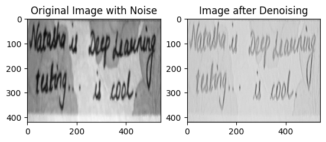

Software Developer in ICICI SECURITIES..
Looking for the following roles-->
## Data Scientist | Machine Learning | Deep Learning

#### Technical Skills : - Python,SQL,POWER BI, Advance Excel
#### Projects :- Machine Learning, Deep Learning, Data Analysis and Creating Dashboard, NLP

## Education
- Bachelor of Computer Engineering (B.E) (2017-2021) | CGPA - 7.18 | University of Mumbai
- 12th (HSC Board)  PCM (Computer Science) (2016-2017) | Percentage -  76.15 | Maharashtra Board
- 10th (SSC Board)  (2014-2015) | Percentage - 85.40 | Maharashtra Board

## Work Experience
**Software Developer @ ICICI SECURITIES** (2021 - Present)
- Working on ProC, Python Programming language and Oracle (SQL Query Language) to deliver different products through Automation
- Have worked on different Whatsapp modules for Automation and Analysis and Site and App Login Modules

## Projects
### Stock Price Prediction using LSTM Version
- Data Analysis and Visualization along with Prediction of Close Price using [ Long Short Term Memory (LSTM) ] of Tesla Stock.
- [Project Link Here](https://www.kaggle.com/code/natashameshram/stock-price-prediction-using-lstm-version-2)
- .png)

### Image Denoising using AutoEncoders
- We ever have faced trouble dealing with a hardcopy that has some ink fallen on or which is unclear or we have wrinkles on that paper and we have that only copy and we want to submit a clear version of that same piece then we can use the following model.
- Used Autoencoder for removing noise from the background image
- [Project link here](https://www.kaggle.com/code/natashameshram/image-denoising-autoencoders)
- 

 ### Generating Fake Faces with Generative Adversarial Network
 - Isn't it spooky if i tell you that 

## Certifications

